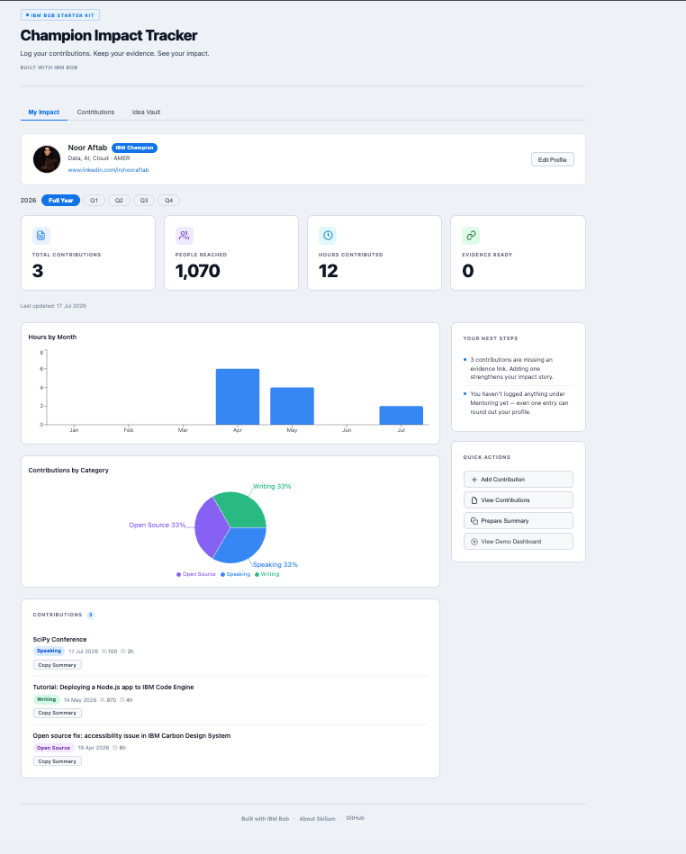

# Champion Copilot — Champion Impact Tracker

<table>
  <tr>
    <td width="35%" align="center">
      
    </td>
    <td width="65%">
      <strong>Track your IBM Champion contributions, visualise your impact, and build nomination-ready evidence—all in your browser, with no login required.</strong>
      <br><br>
      Built as a practical personal companion for documenting advocacy, preserving evidence, and preparing activity summaries.
    </td>
  </tr>
</table>

## App preview



## Get started

```bash
git clone https://github.com/aftabn81/ibm-bob-starter.git
cd ibm-bob-starter
npm install
npm run dev
```

Open the local link shown in your terminal.

## What it helps you do

- Log speaking, writing, mentoring, training, open-source, and community contributions
- See hours contributed, people reached, categories, and evidence readiness
- Prepare copyable contribution summaries
- Save ideas for future activities
- Keep your profile and records in one personal workspace

## Created by

[Noor Aftab](https://www.linkedin.com/in/nooraftab) · [Skilium](https://skilium.ai) · [IBM Bob](https://www.linkedin.com/company/ibmbob/)

Independent community-built project. Not an official IBM product.
